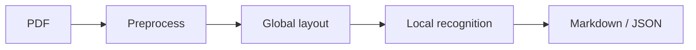
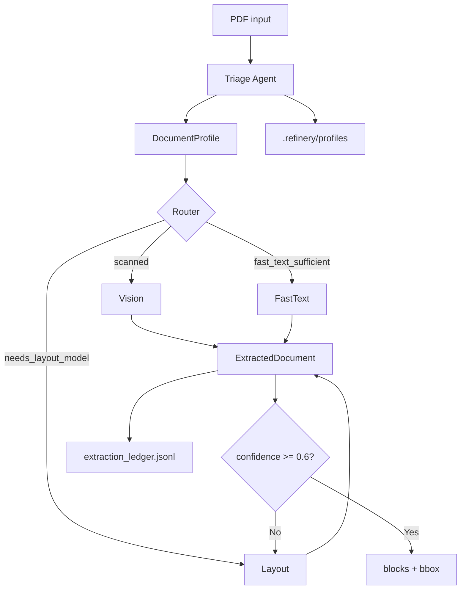

# Domain Notes — Phase 0: Document Science Primer

## 1. Extraction strategy decision tree

```
                         Incoming PDF
                              │
                              ▼
                    ┌─────────────────┐
                    │  TRIAGE AGENT   │
                    │  (pdfplumber)    │
                    │  • char count    │
                    │  • image ratio   │
                    │  • table count   │
                    │  • figure ratio  │
                    │  • language      │
                    │  • domain hint   │
                    └────────┬────────┘
                             │
         ┌───────────────────┼───────────────────┐
         ▼                   ▼                   ▼
   origin_type        layout_complexity    extraction_cost
   (4 values)         (5 values)           (3 values)
         │                   │                   │
         └───────────────────┴───────────────────┘
                             │
         ┌───────────────────┼───────────────────┐
         ▼                   ▼                   ▼
   SCANNED_IMAGE    →  NEEDS_VISION_MODEL   →  VisionExtractor
   FORM_FILLABLE    →  NEEDS_LAYOUT_MODEL  →  LayoutExtractor
   NATIVE_DIGITAL   │  SINGLE_COLUMN       →  FAST_TEXT_SUFFICIENT → FastTextExtractor
   + SINGLE_COLUMN  │  TABLE_HEAVY         │  MULTI_COLUMN         →  LayoutExtractor
   MIXED / else     →  NEEDS_LAYOUT_MODEL  │  FIGURE_HEAVY        │  MIXED
                             │
                             ▼
                    confidence < 0.6 ?
                             │
                    Yes → Escalate to LayoutExtractor
                    No  → Use chosen strategy output
```

**Thresholds (see `rubric/extraction_rules.yaml`):**

- **Origin:** `char_threshold=100`, `image_area_ratio_threshold=0.5`. Low chars + high image ratio → scanned. **Font metadata:** In the page loop we count chars with `fontname`; `font_ratio = chars_with_font / total_chars`. High font_ratio (≥0.6) + low image_ratio → native_digital; low font_ratio (<0.2) + high image_ratio → scanned.
- **Layout:** `table_heavy_threshold=3` (tables per doc), `figure_heavy_ratio=0.4` (image area / page area). Multi-column via character x-position split (25–75% left/right).
- **Escalation:** `confidence_escalation_threshold=0.6`.
- **Fast strategy confidence:** Per-page: `char_count`, `char_density` (chars/area), `image_ratio`, `font_ratio` (chars with fontname / total chars). Formula uses `strategies.fast`: `char_count_min`, `image_ratio_max`, `font_meta_weight`. If `char_count >= char_count_min` and `image_ratio <= image_ratio_max`, confidence = base + font_ratio × font_meta_weight (capped at 1.0); else reduced. Document confidence = min(page confidences).

---

## 2. Failure modes observed

| Failure mode | Description | When it happens | Mitigation in this pipeline |
|-------------|-------------|-----------------|-----------------------------|
| **Structure collapse** | Flattened columns, broken tables, lost headers. | Naive per-page text dump on multi-column/table-heavy PDFs. | Triage sends table_heavy / multi_column → Layout; avoid Fast on complex layout. |
| **Context poverty** | Chunks cut through tables or sentences; RAG retrieves fragments. | Token-based chunking without block awareness. | (Phase 3) Semantic chunking with LDUs and rules (no split inside table, etc.). |
| **Provenance blindness** | Cannot cite “where in the document.” | No page/bbox on extracted content. | ExtractedDocument stores `bbox` and `page` per block; later phases add ProvenanceChain. |
| **Scanned as digital** | Low char count but heuristics miss (e.g. small image ratio). | Edge cases in thresholds. | Tune `char_threshold` and `image_area_ratio_threshold`; escalation to Layout/Vision on low confidence. |
| **Vision/OCR unavailable** | Tesseract not installed. | Router selects Vision but runtime fails. | Router catches TesseractNotFoundError and falls back to Layout (layout_vision_fallback). |
| **Language undetected** | Amharic or other language → `und`. | langdetect/fast-langdetect fail or no text. | fast-langdetect (176 langs) primary; Ethiopic script fallback for Amharic; then `und`. |

---

## 3. Pipeline diagrams

### 3.1 MinerU (reference)

- **Stage 1:** Global layout analysis on downsampled images.
- **Stage 2:** Local content recognition on native-resolution crops (tables, formulas, text).
- **Output:** Structured layout (e.g. model.json) + Markdown.



### 3.2 Refinery pipeline (Phases 0–2)



### 3.3 Character density / bbox (what to observe)

- **Native digital:** Many `page.chars`; high character density; many small bboxes; low image_area_ratio.
- **Scanned:** Few or no chars; near-zero density; image_area_ratio high; whitespace_ratio high (one big image).
- **Table-heavy:** High `line_count`/`rect_count`; tables detected by pdfplumber `find_tables()`.

Run `scripts/pdfplumber_analysis.py` to get `page_metrics.csv` and `document_summary.csv` (char_count, char_density, whitespace_ratio, image_area_ratio, scanned_likely, origin_type_guess, layout_complexity_guess).

---

## 4. Docling vs pdfplumber (comparison)

- **pdfplumber:** Best on digital PDFs; uses existing character stream; fast; no layout model; tables via `find_tables()`.
- **Docling:** Layout model + TableFormer; better on mixed/table-heavy; structured JSON/Markdown with hierarchy.

**How to compare:** Run both on the same document:

- `uv run python scripts/pdfplumber_analysis.py --data-dir data --out-dir .refinery/phase0/pdfplumber`
- `uv run python scripts/docline.py --data-dir data --out-dir .refinery/phase0/docling`

Then compare table structure, reading order, and section boundaries in the Docling Markdown under `.refinery/phase0/docling/*.md` vs the refinery’s extracted blocks.

---

## 5. How to run Phase 0 tooling

| Task | Command |
|------|--------|
| pdfplumber analysis (char density, bbox, whitespace) | `uv run python scripts/pdfplumber.py --data-dir data --out-dir .refinery/phase0/pdfplumber` |
| Docling conversion | `uv run python scripts/docline.py --data-dir data --out-dir .refinery/phase0/docling` |
| MinerU conversion | `uv run python scripts/mineru.py --data-dir data --out-dir .refinery/phase0/mineru` (requires `pip install mineru`) |
| All three (pdfplumber + Docling + MinerU) | `uv run python scripts/run_all_extractors.py data/ -o .refinery/compare_out` |

Outputs: `page_metrics.csv`, `document_summary.csv`, `threshold_draft.json` (pdfplumber); `*.md` + `*_metrics.jsonl` (Docling); `mineru/*.md` + `mineru_metrics.jsonl` (MinerU).
